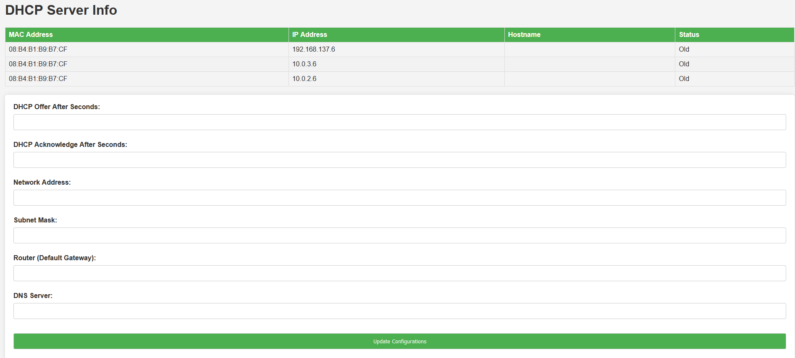

Python DHCP Server
------------------

[Download][releases]

This is a purely Python DHCP server that does not require any additional libraries or installs other that Python 3.

It was testet under Ubuntu 14 with Python and Windows 7. It does not use any operating system specific Python functions, so it should work when Python 3 works.

  
dhcpgui lists MAC address, IP address and host name.

This DHCP server program will assign IP addresses ten seconds after it received packets from clients. So it can be used in networks that already have a dhcp server running.

This Python DHCP server
- shows clients in the network
- lists IP address, Mac address and host name
- highlights recently refreshed/added clients
- assigns IP addresses 10 seconds later than usual DHCP servers
- remembers addresses in the `hosts.csv` file.
- can be configured to serve all DHCP options using Python

Contributions welcome!

Windows
-------

You can install this software by downloading the [release][releases] named `python_dhcp_server_standalone_X.Y.zip` file.
Unpack the zip file, you will find an executable `.exe` file inside.

Linux
-----

Under Linux you can download the [source code][zip] and install Python 3 and Tkinter for Python 3:

```
sudo apt-get install python3 python3-tk
```

There are different ways to start:
1. You can use the `python_dhcp_server.desktop` and double-click it.
    If it does not open, please [report it][issues] and try the next one.
2. You can run the following command provided you are in the `server`
    directory.
    ```
    sudo python3 ./dhcpgui.pyw
    ```

Related Work
------------

This program was created to find Raspberry Pis in the network.

- [Adafruit-Pi-Finder](https://github.com/adafruit/Adafruit-Pi-Finder) - finde deinen Raspberry Pi im Netzwerk
- [Angry IP](https://angryip.org/) (Windows)

New Releases
------------

When the source code is changed, create a new release.
1. Create a new tag
    ```
    git tag 0.6
    git push origin 0.6
    ```
2. Download the [latest release](https://github.com/niccokunzmann/python_dhcp_server/releases/download/0.5/python_dhcp_server_standalone_0.5.zip).
    ```
    cd Downloads
    wget 'https://github.com/niccokunzmann/python_dhcp_server/releases/download/0.5/python_dhcp_server_standalone_0.5.zip'
    ```
3. Unzip it.
    ```
    unzip python_dhcp_server_standalone_0.5.zip
    ```
4. Replace the `server` directory.
    ```
    cd python_dhcp_server_standalone
    rm -r server
    cp -r ~/python_dhcp_server/server/ .
    rm -r server/__pycache__
    ```
5. Zip the release.
    ```
    zip -9r python_dhcp_server_standalone_0.6.zip python_dhcp_server_standalone
    ```
6. Upload the zip file to the [pushed release][releases].


[releases]: https://github.com/niccokunzmann/python_dhcp_server/releases
[zip]: https://github.com/niccokunzmann/python_dhcp_server/archive/refs/heads/master.zip
[issues]: https://github.com/niccokunzmann/python_dhcp_server/issues


WebGUI Fork:

Web GUI Enhancement: In addition to its core DHCP functionalities, this Python DHCP Server features an integrated Web GUI, providing a more intuitive and user-friendly interface for monitoring and managing network clients. Accessible directly through your web browser, the GUI displays real-time information about connected clients, including their MAC addresses, IP addresses, and host names. It simplifies server management tasks, such as tracking newly connected devices and reviewing client details, making it an invaluable tool for network administrators and users who prefer graphical interfaces over traditional command-line operations.

The web GUI also allowed users to alter the configuration file from the browser, however this feature is still under development. At the current time it can alter the DHCP offer and Acknowledge  timers, subnet, subnet mask, default gateway, and DNS server

https://github.com/VNGLR/python_dhcp_server/tree/webgui

  